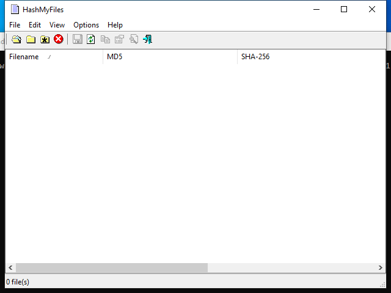

<!-- generated-by: scripts/generate_gui_pages.py -->
# HashMyFiles (GUI)

**Capability:** acquire preserve  **Window:** `HashMyFiles`  **Version:** —
**Captured:** `C:\Tools\HashMyFiles\HashMyFiles.exe` on 2026-08-02 — control tree in [`capture/gui/HashMyFiles/HashMyFiles.tree.txt`](../../capture/gui/HashMyFiles/HashMyFiles.tree.txt)

[← Capability index](../INDEX.md) · [Kit tool list](../../catalog/KIT-TOOLS.md)

## Purpose

Hash a set of files and compare the results.

## Window

## Controls

All 4 nodes come from the capture; the 1 interactive controls are listed here.

| Control | Type | AutomationId | What it does |
|---|---|---|---|
| **0 file(s)** | Pane | `257` | |

## Using it

1. Drag files, or a folder, onto the window.
2. Read the count in the status pane to confirm everything you expected was taken — it is the only feedback that files were missed.
3. Sort by hash to group identical files; duplicates across directories collapse immediately.
4. Copy the hashes out for the report, or save them as the record of what was collected.

## Gotchas

- Hashing here is for triage and deduplication. It is not acquisition — an image's hash of record comes from the acquisition tool that made it.
- It follows what you dropped and nothing more. A folder dropped without recursion silently hashes only the top level.
