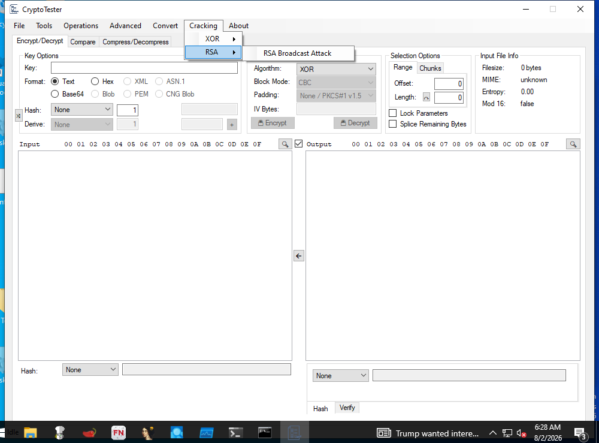

<!-- generated-by: scripts/generate_gui_pages.py -->
# CryptoTester (GUI)

**Capability:** decode deobfuscate  **Window:** `WindowsForms10.Window.8.app.0.141b42a_r7_ad1`  **Version:** —
**Captured:** `C:\Tools\CryptoTester\CryptoTester.exe` on 2026-08-02 — control tree in [`capture/gui/CryptoTester/CryptoTester.tree.txt`](../../capture/gui/CryptoTester/CryptoTester.tree.txt)

[← Capability index](../INDEX.md) · [Kit tool list](../../catalog/KIT-TOOLS.md)

## Purpose

Try cryptographic operations against a sample.

## Window

## Controls

All 149 nodes come from the capture; the 97 interactive controls are listed here.

| Control | Type | AutomationId | What it does |
|---|---|---|---|
| **Idle** | Text | `—` | |
| **File** | MenuItem | `—` | |
| **Open File** | MenuItem | `—` | |
| **Input** | MenuItem | `—` | |
| **Text** | MenuItem | `—` | |
| **Base64** | MenuItem | `—` | |
| **Zero Bytes** | MenuItem | `—` | |
| **Sequential Bytes** | MenuItem | `—` | |
| **Integer** | MenuItem | `—` | |
| **Chrysanthemum.jpg** | MenuItem | `—` | |
| **Desert.jpg** | MenuItem | `—` | |
| **Save Output** | MenuItem | `—` | |
| **Tools** | MenuItem | `—` | |
| **Blob Analyzer** | MenuItem | `—` | |
| **RSA Calculator** | MenuItem | `—` | |
| **Key Finder** | MenuItem | `—` | |
| **Keystream Finder** | MenuItem | `—` | |
| **RNG Tester** | MenuItem | `—` | |
| **Base Encoder** | MenuItem | `—` | |
| **String Encoder** | MenuItem | `—` | |
| **Unit Tester** | MenuItem | `—` | |
| **ECC Validator** | MenuItem | `—` | |
| **Chunk Viewer** | MenuItem | `—` | |
| **Operations** | MenuItem | `—` | |
| **XOR Files** | MenuItem | `—` | |
| **AND Files** | MenuItem | `—` | |
| **Generate Keystream** | MenuItem | `—` | |
| **Visual Difference** | MenuItem | `—` | |
| **Bruteforce Algorithm** | MenuItem | `—` | |
| **Bruteforce Keys** | MenuItem | `—` | |
| **Attempt Blind Decryption** | MenuItem | `—` | |
| **Advanced** | MenuItem | `—` | |
| **Little Endian** | MenuItem | `—` | |
| **Custom** | MenuItem | `—` | |
| **Rounds** | MenuItem | `—` | |
| **Constant** | MenuItem | `—` | |
| **Position** | MenuItem | `—` | |
| **Matrix** | MenuItem | `—` | |
| **IV** | MenuItem | `—` | |
| **Get IV From Input** | MenuItem | `—` | |
| **Auto Derive IV** | MenuItem | `—` | |
| **Enter Text IV** | MenuItem | `—` | |
| **Recover IV From Plaintext** | MenuItem | `—` | |
| **Presets** | MenuItem | `—` | |
| **HiddenTear** | MenuItem | `—` | |
| **OpenSSL** | MenuItem | `—` | |
| **DiskCryptorVolumeHeader** | MenuItem | `—` | |
| **Convert** | MenuItem | `—` | |
| **DWORD ⇆ Integer** | MenuItem | `—` | |
| **Hex ⇆ Integers** | MenuItem | `—` | |
| **Cracking** | MenuItem | `—` | |
| **XOR** | MenuItem | `—` | |
| **XOR Attack** | MenuItem | `—` | |
| **RSA** | MenuItem | `—` | |
| **RSA Broadcast Attack** | MenuItem | `—` | |
| **About** | MenuItem | `—` | |
| **Filesize:** | Text | `459008` | |
| **MIME:** | Text | `917746` | |
| **Mod 16:** | Text | `589930` | |
| **Entropy:** | Text | `720998` | |
| **false** | Text | `131636` | |
| **unknown** | Text | `590202` | |
| **0.00** | Text | `393764` | |
| **0 bytes** | Text | `589906` | |
| **Offset:** | Text | `262752` | |
| **Length:** | Text | `197238` | |
| **None** | ComboBox | `66176` | |
| **Open** | Button | `—` | |
| **Derive:** | ComboBox | `66180` | |
| **Derive:** | Text | `—` | |
| **Hash:** | Text | `66204` | |
| **Format:** | Text | `66210` | |
| **Key:** | Text | `66216` | |
| **IV Bytes:** | ComboBox | `66224` | |
| **IV Bytes:** | Text | `—` | |
| **Block Mode:** | Text | `66230` | |
| **Algorithm:** | Text | `66232` | |
| **CBC** | ComboBox | `66234` | |
| **Padding:** | Text | `66238` | |
| **None / PKCS#1 v1.5** | ComboBox | `66242` | |
| **Input** | Text | `66252` | |
| **Output** | Text | `66254` | |
| **00 01 02 03 04 05 06 07 08 09 0A 0B 0C 0D 0E 0F** | Text | `66256` | |
| **Public Key:** | Text | `66288` | |

## Using it

_TODO: numbered click-path, at most seven steps per task._

## Gotchas

_TODO: what surprises an analyst here._
