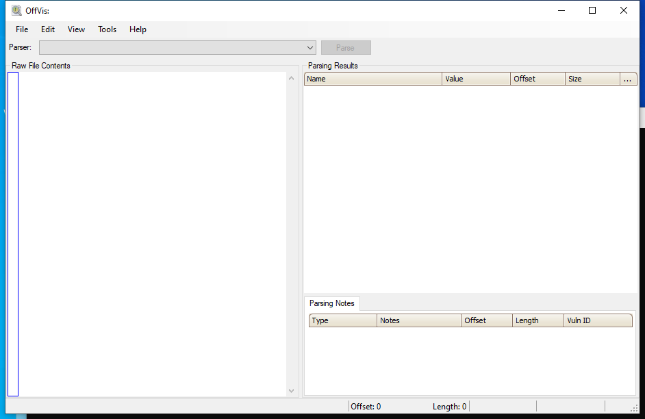

<!-- generated-by: scripts/generate_gui_pages.py -->
# OffVis (GUI)

**Capability:** malware triage documents  **Window:** `WindowsForms10.Window.8.app.0.378734a`  **Version:** —
**Captured:** `C:\Tools\OffVis\OffVis.exe` on 2026-08-02 — control tree in [`capture/gui/OffVis/OffVis.tree.txt`](../../capture/gui/OffVis/OffVis.tree.txt)

[← Capability index](../INDEX.md) · [Kit tool list](../../catalog/KIT-TOOLS.md)

## Purpose

Visualise Office binary file structure.

## Window

## Controls

All 19 nodes come from the capture; the 7 interactive controls are listed here.

| Control | Type | AutomationId | What it does |
|---|---|---|---|
| **Raw File Contents** | Pane | `459370` | |
| **Parsing Results** | Pane | `262750` | |
| **Parsing Notes** | Pane | `262732` | |
| **Parse** | Pane | `197186` | |
| **Parser:** | Pane | `197182` | |
| **menuStrip1** | Pane | `197178` | |
| **statusStrip1** | Pane | `197176` | |

## Using it

1. Open the legacy Office binary — `.doc`, `.xls`, `.ppt`.
2. Read the parsed structure against the raw bytes shown alongside it.
3. Compare what the record headers claim against what is actually present; the mismatch is the exploit.

## Gotchas

- It only understands the *binary* formats. OOXML files — `.docx`, `.xlsx` — are ZIP archives and this tool cannot read them; unzip and use `oledump.py` on the extracted `vbaProject.bin`.
- It is a structure visualiser, not a detector. It shows you the record layout so you can see the malformation; it does not tell you one is present.
- The tool is old and unmaintained. Treat a crash as information about the file rather than a reason to stop.
