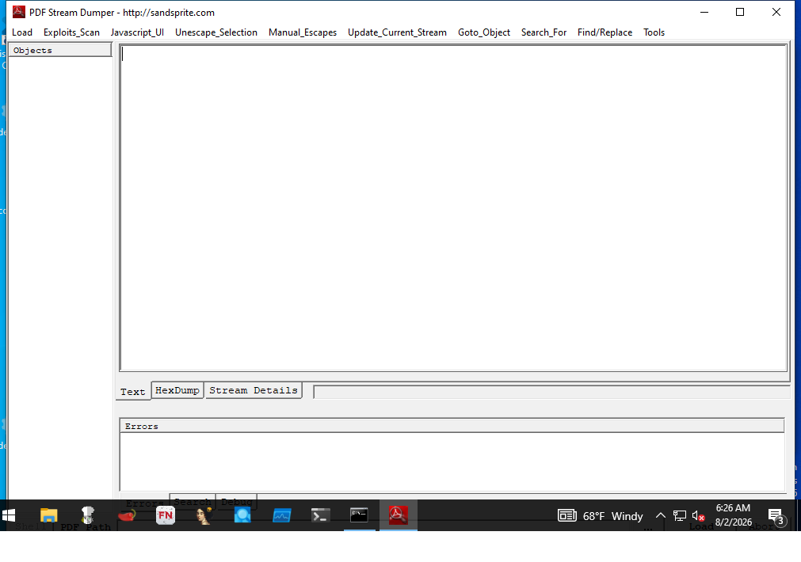

<!-- generated-by: scripts/generate_gui_pages.py -->
# PDFStreamDumper (GUI)

**Capability:** malware triage documents  **Window:** `ThunderRT6FormDC`  **Version:** —
**Captured:** `C:\Tools\PDFStreamDumper\PDFStreamDumper.exe` on 2026-08-02 — control tree in [`capture/gui/PDFStreamDumper/PDFStreamDumper.tree.txt`](../../capture/gui/PDFStreamDumper/PDFStreamDumper.tree.txt)

[← Capability index](../INDEX.md) · [Kit tool list](../../catalog/KIT-TOOLS.md)

## Purpose

Inspect and extract PDF object streams.

## Window

## Using it

_TODO: numbered click-path, at most seven steps per task._

## Gotchas

_TODO: what surprises an analyst here._
