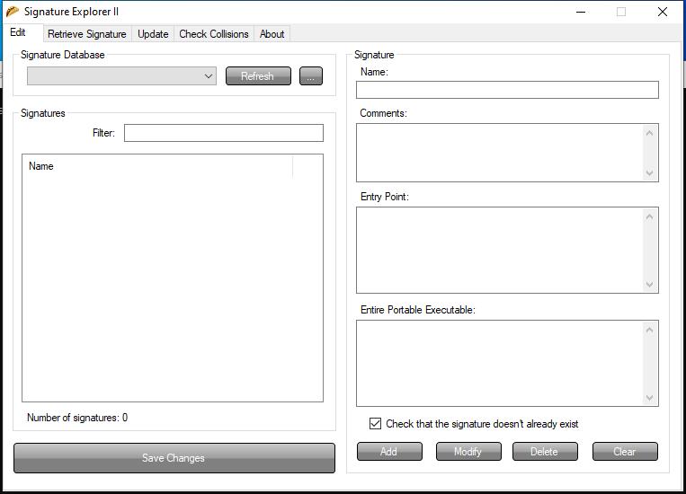

<!-- generated-by: scripts/generate_gui_pages.py -->
# Signature-Explorer (GUI)

**Capability:** malware triage static  **Window title:** Signature Explorer II
**Captured:** `C:\Tools\Explorer Suite\Signature Explorer.exe` on 2026-08-02 — control tree in [`capture/gui/Signature-Explorer/Signature-Explorer.tree.txt`](../../capture/gui/Signature-Explorer/Signature-Explorer.tree.txt)

[← Capability index](../INDEX.md) · [Kit tool list](../../catalog/KIT-TOOLS.md)

## Purpose

Browse, edit and add to the packer signature database that PE Detective and CFF Explorer read. This is how a sample nothing recognises becomes a signature that catches the next one.

## Window

## Controls

The window exposes 18 further named controls: **Edit**, **Save Changes**, **Signature**, **Check that the signature doesn't already exist**, **Clear**, **Delete**, **Modify**, **Add**, **Entire Portable Executable:**, **Entry Point:**, **Comments:**, **Name:**, **Signatures**, **Number of signatures: 0**, **Filter:**, **Signature Database**, **...**, **Refresh**. The full tree, with every automation id, is in [the capture](../../capture/gui/Signature-Explorer/Signature-Explorer.tree.txt).

## Using it

1. Open the signature database from the **Signatures** pane.
2. Use **Check that the signature doesn't already exist** before adding anything — duplicates are the usual way a database rots.
3. Fill **Name:**, **Entry Point:** and, where the pattern is not at the entry point, **Entire Portable Executable:**.
4. Record why the signature exists in **Comments:** — a pattern with no rationale cannot be reviewed later.
5. Press **Add**, then **Save Changes**.

## Gotchas

- This edits the database that PE Detective and CFF Explorer read. A bad signature here produces confident wrong answers in both.
- Entry-point signatures miss anything that relocates the entry point, which is exactly what many packers do. Prefer a whole-file pattern when the sample allows it.
- **Save Changes** is a separate action. Adding a signature and closing the window loses it.
