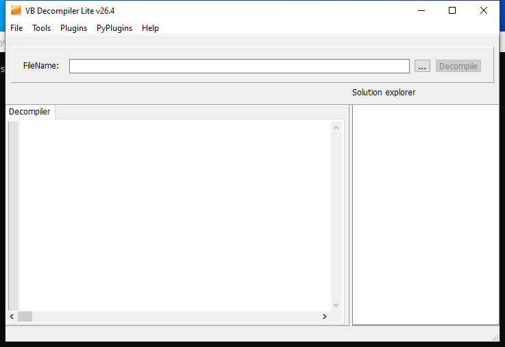

<!-- generated-by: scripts/generate_gui_pages.py -->
# VB-Decompiler (GUI)

**Capability:** reverse engineering  **Window:** `t0000000`  **Version:** v26.4
**Captured:** `C:\Tools\VB Decompiler\VB Decompiler.exe` on 2026-08-02 — control tree in [`capture/gui/VB-Decompiler/VB-Decompiler.tree.txt`](../../capture/gui/VB-Decompiler/VB-Decompiler.tree.txt)

[← Capability index](../INDEX.md) · [Kit tool list](../../catalog/KIT-TOOLS.md)

## Purpose

Visual Basic decompiler.

## Window

## Using it

_TODO: numbered click-path, at most seven steps per task._

## Gotchas

_TODO: what surprises an analyst here._
