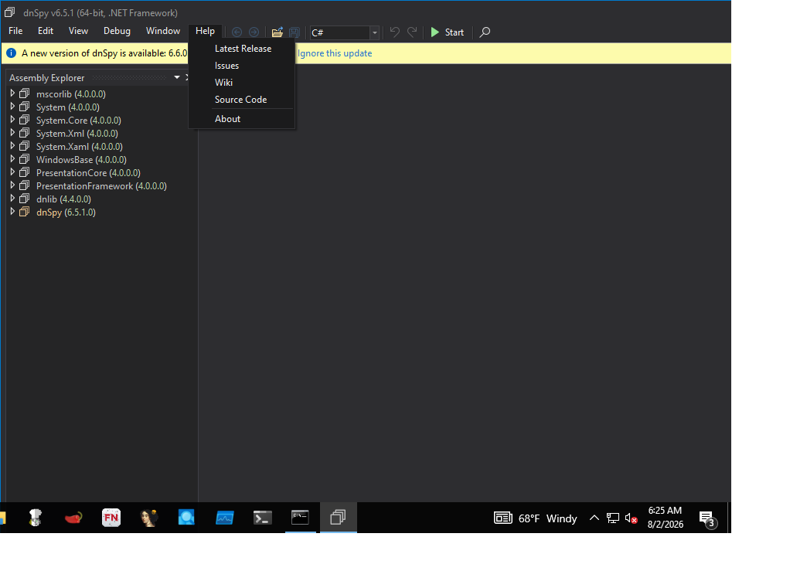

<!-- generated-by: scripts/generate_gui_pages.py -->
# dnSpy (GUI)

**Capability:** reverse engineering  **Window title:** dnSpy v6.5.1 (64-bit, .NET Framework)  **Version:** v6.5.1
**Captured:** `C:\Tools\dnSpy\dnSpy.exe` on 2026-08-02 — control tree in [`capture/gui/dnSpy/dnSpy.tree.txt`](../../capture/gui/dnSpy/dnSpy.tree.txt)

[← Capability index](../INDEX.md) · [Kit tool list](../../catalog/KIT-TOOLS.md)

## Purpose

Decompile, browse and debug .NET assemblies. It reconstructs readable C# from IL, so a managed sample is usually faster to understand here than in a disassembler, and it can attach a debugger to the running assembly when static reading stalls.

## Window

## Controls

The window exposes 146 further named controls: **File**, **Export to Project...**, **Export to Pro_ject...**, **Save...**, **_Save...**, **Save Module...**, **Save _Module...**, **Save All...**, **Save A_ll...**, **Open...**, **_Open...**, **Open from GAC...**, **Open from _GAC...**, **Open List...**, **Open L_ist...**, **Recent Files**, **Recent _Files**, **Reload All Assemblies**, **_Reload All Assemblies**, **Close All**, **Close Old In-Memory Modules**, **Close All Framework Assemblies**, **Close All Missing Files**, **Sort Assemblies**, **Sor_t Assemblies**, **Restart as Administrator**, **Exit**, **E_xit**, **Edit**, **Undo**, **Redo**, **Find**, **_Find**, **Search Assemblies**, **_Search Assemblies**, **Create Assembly...**, **Create NetModule...**, **View**, **Word Wrap**, **_Word Wrap**, and 106 more. The full tree, with every automation id, is in [the capture](../../capture/gui/dnSpy/dnSpy.tree.txt).

## Using it

1. **Open** the .NET assembly.
2. Read the decompiled C# rather than the IL first — .NET decompiles cleanly enough that the source is usually the fastest route.
3. Use **Search Assemblies** for the strings and API names that matter, instead of browsing the namespace tree.
4. Set a breakpoint and start debugging when static reading stalls — this is a debugger as well as a decompiler, which is the reason to choose it.
5. **Export to Project...** when the assembly is worth reading as a whole in an editor.

## Gotchas

- Obfuscated assemblies decompile into something that looks like code and is not. Names are meaningless after obfuscation; the control flow may be too. De-obfuscate first with `de4dot`.
- Debugging runs the sample. Do it only on the isolated VM, with no network path out.
- It edits and recompiles assemblies. That is useful and it is also how evidence gets modified by accident — work on a copy.
