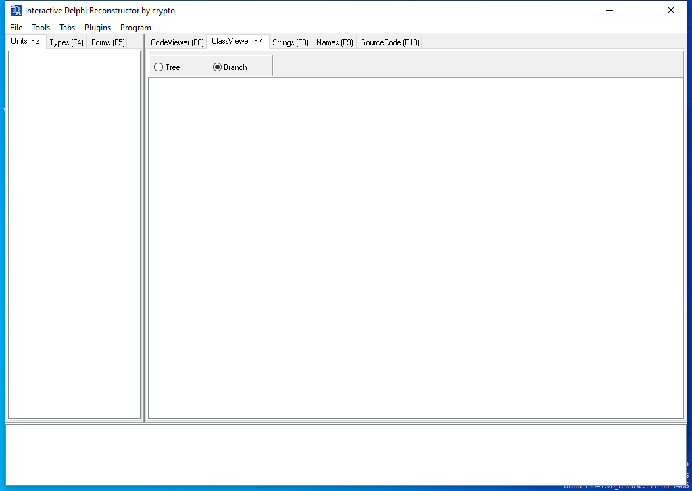

<!-- generated-by: scripts/generate_gui_pages.py -->
# idr (GUI)

**Capability:** reverse engineering  **Window:** `TFMain_11011981`  **Version:** —
**Captured:** `C:\Tools\idr\idr.exe` on 2026-08-02 — control tree in [`capture/gui/idr/idr.tree.txt`](../../capture/gui/idr/idr.tree.txt)

[← Capability index](../INDEX.md) · [Kit tool list](../../catalog/KIT-TOOLS.md)

## Purpose

Reconstruct Delphi programs: identify the runtime library, recover form definitions and name the event handlers. Delphi binaries are mostly runtime code, so separating the author's few hundred lines from the library's tens of thousands is the difference between a tractable job and an intractable one.

## Window

## Controls

The window exposes 4 further named controls: **Units (F2)**, **ClassViewer (F7)**, **Branch**, **Tree**. The full tree, with every automation id, is in [the capture](../../capture/gui/idr/idr.tree.txt).

## Using it

1. Open the Delphi executable.
2. Let it match the runtime library first; without that, most of the disassembly is Delphi's own code rather than the author's.
3. Read the reconstructed forms and event handlers, which is where Delphi programs keep their logic.

## Gotchas

- Delphi binaries are mostly runtime. Library signature matching is what separates the few hundred lines that matter from the tens of thousands that do not.
- The knowledge base is version-specific. A mismatch against the Delphi version used to build the sample leaves the runtime unidentified and the output far less useful.
