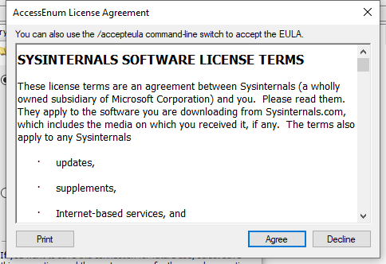

<!-- generated-by: scripts/generate_gui_pages.py -->
# AccessEnum (GUI)

**Capability:** windows artifacts  **Window:** `#32770`  **Version:** —
**Captured:** `C:\Tools\sysinternals\AccessEnum.exe` on 2026-08-02 — control tree in [`capture/gui/AccessEnum/AccessEnum.tree.txt`](../../capture/gui/AccessEnum/AccessEnum.tree.txt)

[← Capability index](../INDEX.md) · [Kit tool list](../../catalog/KIT-TOOLS.md)

## Purpose

Enumerate the effective permissions across a directory tree or registry branch and show them in one list. Sorting by permission surfaces the outlier — the world-writable path that does not belong.

## Window

## Controls

The window exposes 4 further named controls: **You can also use the /accepteula command-line switch to accept the EULA.**, **Agree**, **Decline**, **Print**. The full tree, with every automation id, is in [the capture](../../capture/gui/AccessEnum/AccessEnum.tree.txt).

## Using it

1. Accept the licence on first run; until that is done the tool never reaches its main window.
2. Choose the directory or registry key to enumerate.
3. Run the scan, then sort by the permissions column rather than by path — the outliers are the finding, and they do not cluster by location.
4. Save the results as the before-state when you are about to change anything.

## Gotchas

- It reports what the ACLs say, not what is reachable. Group membership, inheritance and share permissions all sit on top of this.
- The capture behind this page is the licence dialog, not the tool: a first run shows the EULA and nothing else. Sysinternals binaries need `-accepteula` before they can be driven automatically, so the control table here documents that dialog rather than the main window.
